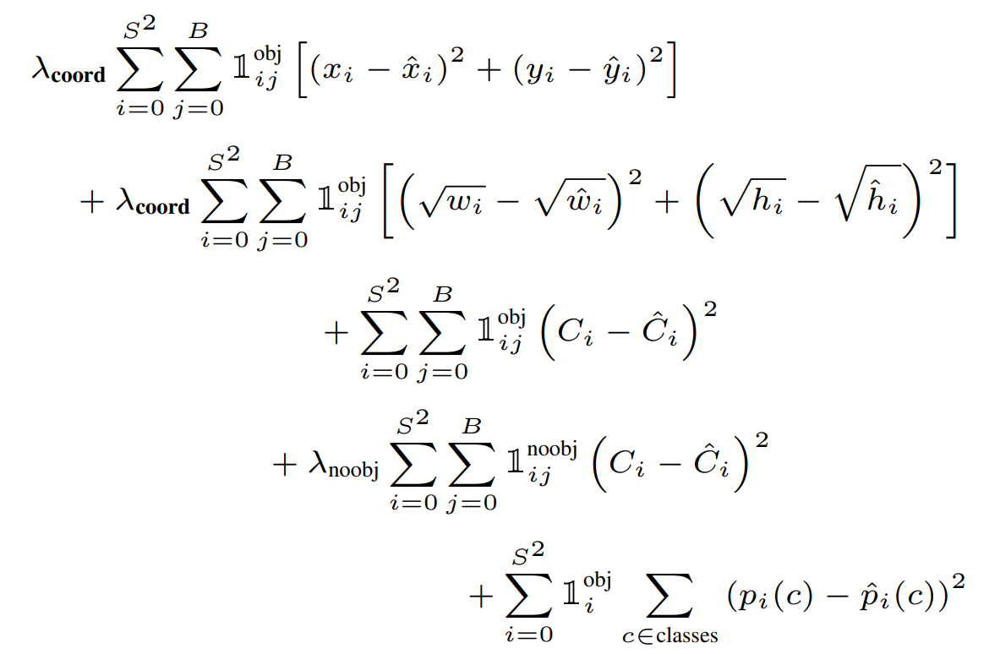
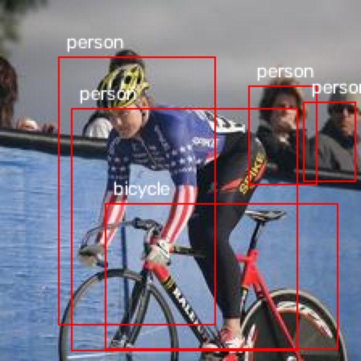
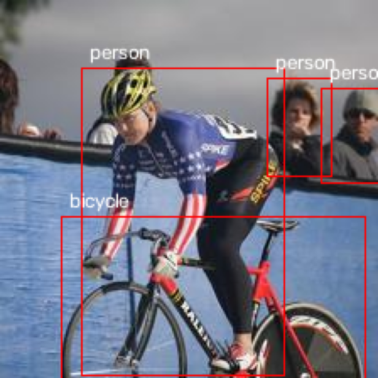
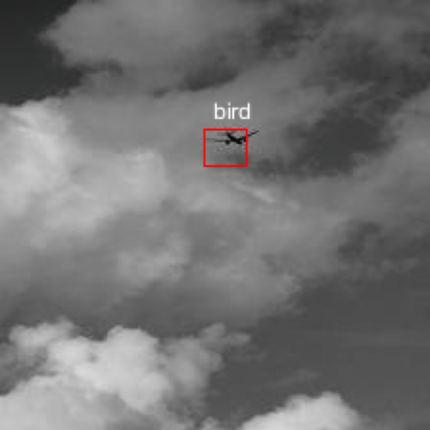
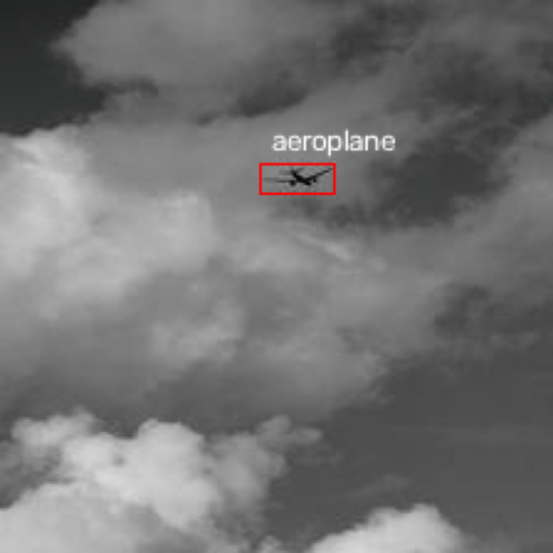
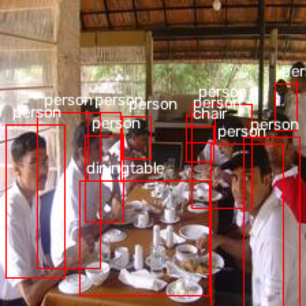
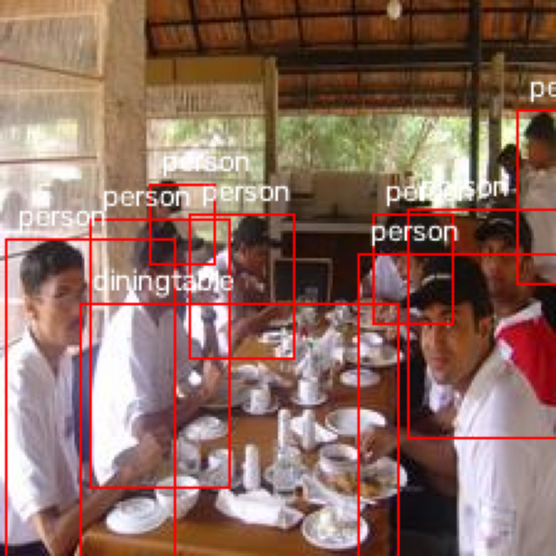
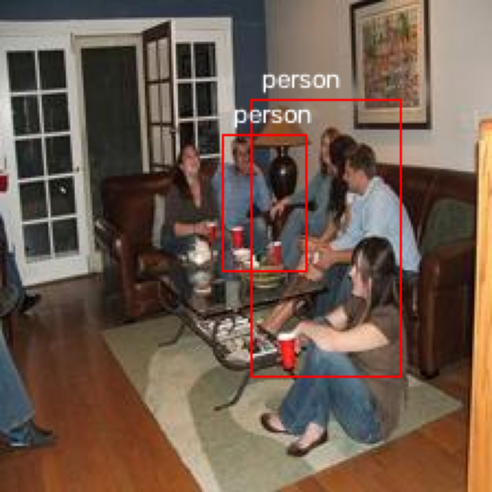
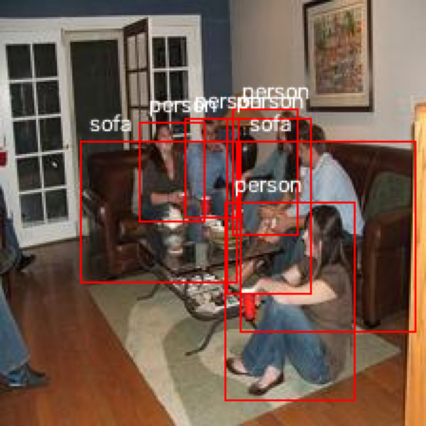

# 📷 **DetectorV1**
As my first computer vision project, I decided to loosely implement YOLOv1 to gain experience with object detectors.
This is not a complete paper implementation, however, because I changed aspects of the original paper such as the architecture and preprocessing to better accommodate my hardware restrictions. 
I developed this project from scratch, writing code for data preprocessing and postprocessing, loss function, evaluation functions, and the training loop, among other things. 

## 🔄 Preprocessing
- I converted the bounding box coordinates of ground truth labels from (x1, y1, x2, y2), where each x-y pair represents a corner of the bounding box, to (x, y, w, h) where x and y represent the center of the bounding box, and w and h represent the width and height of the bounding box, respectively.
- Due to memory and GPU restrictions, I resized every image to 224 x 224 instead of 448 x 448, as described in the YOLOv1 paper. The biggest benefit of this was considerably speeding up training time.
- I normalized the image pixels to map to [0, 1] by dividing each pixel by 255.
- I standardized the image pixels using the mean and standard deviations of the ImageNet-1k dataset (see *Model Architecture*).

## 👷 Model Architecture 
- The backbone is the ResNet-18 model pretrained on the ImageNet-1k dataset. The model's classification head was cut off, specifically the global average pooling and fully connected layers.
- The detector head is a simple convolutional layer with a kernel size of 1 that outputs 25 channels.
- In the 25 channels, the first 20 channels represent the classification portion of the task, and the final 5 channels represent the bounding box prediction (x, y, w, h, and confidence score).
- The model's output vector is of the form [B, W, H, C], where B = batch size, W and H are the spatial dimensions, and C is the channel count.
- In the bounding box portion of the prediction vector, the x, y, and confidence score predictions are activated using a sigmoid layer to map, potentially, negative values to [0, 1].

## ƒ Loss Function
- I implemented the exact loss function described in the YOLOv1 paper.
  

## 🎓 Training
- I trained the model on 80% of the Pascal VOC 2007 training/validation set, and validated my training on the other 20% of the same dataset.
- I used batches of 32 images because of my computer's RAM and VRAM constraints.
- I trained the model for 50 epochs.
- I used the ADAM optimizer. The initial learning rates of the backbone and detector head are 1e-4 and 1e-3, respectively.
- I used the cosine annealing learning rate scheduler with a minimum learning rate of 1e-6 for both the backbone and detector head.
- I saved checkpoints of the model after each epoch.
- I recorded training and validation loss during each epoch, and computed the validation dataset's mean average precision (mAP) every 5 epochs.

## ⚙️ Postprocessing
- Decode the predictions to discern the class prediction and convert the coordinates back to (x1, y1, x2, y2) form.
- Filter out the predictions which have a confidence score lower than the threshold of 0.5.
- While filtering, group the predictions by predicted class in a dictionary.
- In the dictionary, all predictions under each class are sorted by ascending order.
- Non-maximum suppression (NMS) is used to remove predictions with bounding box intersection over unions (IOU) of at least 0.5.

## 📝 Evaluation
- Convert the predictions under each class in the dictionary into true positives if its IoU with the ground truth label is at least 0.5, and false positives otherwise.
- Make another dictionary that records the total number of predictions under each class.
- Compute the average precision (AP) of each class.
- Compute the mean average precision (mAP) by averaging the AP results.

## 📊 Results
The model's performance was not great, but I am satisfied with the results as this project taught me a lot about the machine learning workflow from first principles.  

During training, the best model's training loss was 0.5334, validation loss was 6.1251 (a clear sign of overfitting), and the validation mAP was 14.51%.  

On the test set, the best model's mAP is 13.31%.  

Below are some example images, comparing the predicted bounding boxes (images to the left) to the ground truth bounding boxes (images to the right):  
 
 
 
 
